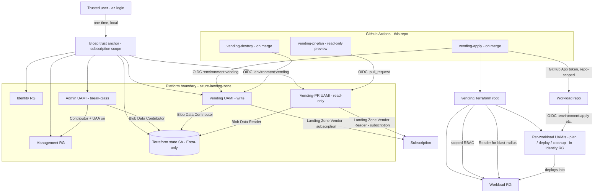
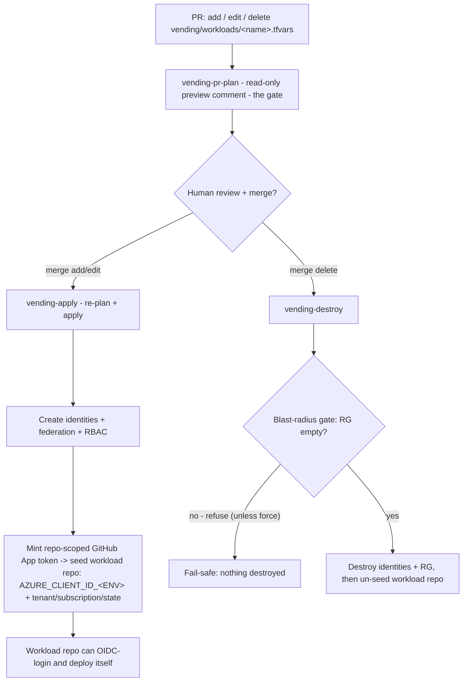

# Architecture

How this **platform landing zone** is built: its components, the trust and identity
model, and the end-to-end vending lifecycle. For the hands-on operating and onboarding
steps see [onboarding.md](onboarding.md); for the security rationale see
[security-model.md](security-model.md).

Editable source diagrams live in [diagrams/](diagrams/) (draw.io / diagrams.net):
[architecture.drawio](diagrams/architecture.drawio) and
[vending-lifecycle.drawio](diagrams/vending-lifecycle.drawio). The Mermaid diagrams below
render inline on GitHub and are the quick reference.

## Overview

Two repositories with different lifecycles:

| | Platform (this repo) | Workload |
|---|---|---|
| Repository | `azure-landing-zone` | e.g. `terraform-aks-sandbox` |
| Owns | Trust anchor, shared state backend, per-workload CI (Continuous Integration) identities, RBAC (Role-Based Access Control) | The application infrastructure (e.g. an AKS cluster) |
| Lifecycle | Persistent, changes rarely | Disposable, recreated often |
| First run | One manual trust-anchor deployment (irreducible) | None — fully CI/CD from the first commit |

The platform **does not deploy any workload**. It establishes Azure trust once, then
**vends** each workload the identities, GitHub OpenID Connect (OIDC) federation, and
scoped access it needs to deploy *itself*. The only manual step is the trust anchor,
because a new repository has no Azure identity yet.

## Components

| Component | Path | Responsibility |
|---|---|---|
| Trust anchor | [bootstrap-trust/](../bootstrap-trust) | Bicep, run once locally. Creates the platform identities, resource groups, custom roles, and the shared Terraform state storage. See [bootstrap-trust/README.md](../bootstrap-trust/README.md). |
| Vending module | [modules/workload-identity/](../modules/workload-identity) | Guardrailed Terraform module that mints one workload's identities, federation, and least-privilege RBAC. |
| Vending root | [vending/](../vending) | Terraform root that consumes the module for each declared workload, under a per-workload state key. |
| Workload registry | `vending/workloads/<name>.tfvars` | One committed file per workload — the declarations the pipeline acts on. |
| Workflows | [.github/workflows/](../.github/workflows) | `vending-pr-plan` (preview), `vending-apply` (create/update), `vending-destroy` (offboard). |
| Shared config | [config/project.json](../config/project.json) | Platform naming: prefix (`alz`), region (`swedencentral` / `swc`). |
| Seeder App | GitHub App (`alz-vending-seeder`) | Mints a repo-scoped installation token so `vending-apply` can write the vended credentials into the workload's own repository. |

### Trust anchor — `bootstrap-trust/`

A subscription-scope Bicep deployment, run once by a trusted user with `az login`, via the
idempotent `deploy.ps1`. It owns everything that must exist *before* Terraform can run in
CI, and creates **no client secret and no Terraform state**:

- **Resource groups:** management RG (Resource Group) `rg-alz-management-swc` (the
  platform's own resources + state) and identity RG `rg-alz-identity-swc` (the vended
  workload identities, so they outlive their disposable workload RGs).
- **Platform identities** (User-Assigned Managed Identities, in the management RG):
  `id-alz-admin-swc` (break-glass), `id-alz-vending-swc` (write), and
  `id-alz-vending-pr-swc` (read-only, for PR previews).
- **Custom roles:** `Landing Zone Vendor (alz)` (write) and `Landing Zone Vendor Reader
  (alz)` (read-only), both at subscription scope — the minimum actions each identity needs.
- **State storage:** one Entra-ID-only (keyless) storage account with a private `tfstate`
  container, its name derived from `uniqueString(subscription().id)`.
- **Federated credentials + role assignments** wiring each identity to its exact GitHub
  OIDC subject and its least-privilege scope.

`deploy.ps1` also seeds the platform's own GitHub environments and repo variables (see
[bootstrap-trust/README.md](../bootstrap-trust/README.md)).

### Vending module — `modules/workload-identity/`

Workload-agnostic. For one workload it creates, from a single declaration:

- one UAMI per requested role (default archetype: `plan` / `deploy` / `cleanup`);
- one federated credential per `(identity, environment)` pair, exact subject, no wildcards;
- control-plane RBAC on the workload's own RG and data-plane RBAC on the state storage;
- read-only `Reader` for the platform pipeline identities on the workload RG, so the
  pipeline can enumerate the RG's live contents (the destroy blast-radius check).

**Guardrails** are enforced at plan time by input validation — a declaration outside policy
fails before anything is created:

- control-plane role ∈ {`Reader`, `Contributor`} (never `Owner` or role-granting);
- state role ∈ {`Storage Blob Data Reader`, `Storage Blob Data Contributor`};
- OIDC subject contains no wildcards — one repository per credential;
- every identity federates at least one environment.

### Vending root — `vending/`

Consumes the module once per workload. It creates the workload RG itself (so onboarding
needs no manual RG step and offboarding can tear it down), looks up the platform identities
by name to grant them the blast-radius `Reader`, and runs under a **per-workload state key**
(`<name>.tfstate`) so one workload's blast radius stays inside its own state. Its outputs —
`environment_client_ids` and `workload_repo_slug` — drive the automated seeding.

### Workflows — `.github/workflows/`

Three workflows act on changes to `vending/workloads/**`:

- **`vending-pr-plan.yml`** — on a pull request, runs read-only as the PR identity and posts
  a `terraform plan` (or `plan -destroy` for a deletion) **preview comment** — the review
  gate. It uploads no plan artifact. The offboard preview also lists the workload RG's live
  contents (enriched blast-radius inventory).
- **`vending-apply.yml`** — on merge (create/update), **re-plans against current state** and
  applies, then seeds the workload repo via the GitHub App. Also runs on `workflow_dispatch`
  for manual re-run / recovery.
- **`vending-destroy.yml`** — on merge (deletion), re-plans the destroy and applies it, then
  un-seeds the workload repo. A **blast-radius gate** refuses if the RG still holds resources
  (fail-safe; overridable with `force`). Also `workflow_dispatch`-able.

## Trust and component architecture



## Identity and access model

**Platform identities** (owned by the trust anchor, live in `rg-alz-management-swc`):

| Identity | GitHub environment | Azure access | State access | Used by |
|---|---|---|---|---|
| `id-alz-admin-swc` | `admin` (branch `main`) | Contributor + UAA (User Access Administrator) on the management RG | Blob Data Contributor | Break-glass, manual |
| `id-alz-vending-swc` | `vending` (branch `main`) | `Landing Zone Vendor (alz)` at subscription; `Reader` on each workload RG | Blob Data Contributor | `vending-apply` / `vending-destroy` |
| `id-alz-vending-pr-swc` | none (repo-scope variable) | `Landing Zone Vendor Reader (alz)` at subscription; `Reader` on each workload RG | Blob Data Reader | `vending-pr-plan` |

The read-only PR identity runs in the untrusted pull-request context, so it can **preview
but never change** anything. Its job carries no environment, so it reads the repo-level
`VENDING_PR_CLIENT_ID` variable; it federates two subjects — `:pull_request` and
`:ref:refs/heads/main`.

**Per-workload identities** (minted by vending, live in `rg-alz-identity-swc`, consumed from
the workload's own repo). Default archetype:

| Identity | Workload environment | Control-plane role | State role |
|---|---|---|---|
| `id-<workload>-plan-swc` | `plan` | Reader on the workload RG | Blob Data Reader |
| `id-<workload>-deploy-swc` | `apply`, `destroy` | Contributor on the workload RG | Blob Data Contributor |
| `id-<workload>-cleanup-swc` | `cleanup` | Contributor on the workload RG | Blob Data Contributor |

Apply and destroy share the `deploy` identity because Terraform needs the full
create/update/delete lifecycle; separate environments keep separate audit trails. The
`cleanup` identity is vended for a workload's own scheduled time-to-live cleanup — this
platform repo runs no scheduled jobs itself.

## OIDC trust model

Every federated credential uses issuer `https://token.actions.githubusercontent.com`,
audience `api://AzureADTokenExchange`, and an **exact, wildcard-free subject** built from the
repository's immutable owner and repository IDs. The subject's suffix is what ties a token to
one context:

- a job with `environment: X` gets a token whose subject ends `…:environment:X`;
- a `pull_request` job gets `…:pull_request`;
- a push job on `main` with no environment gets `…:ref:refs/heads/main`.

That is why the read-only identity needs two credentials (`:pull_request` for PR previews and
`:ref:refs/heads/main` so it can also preview on merge), and why a workload's `apply` job must
run in `environment: apply` to match the `…:environment:apply` credential vended for it.
Subjects are never committed — `deploy.ps1` derives them from `gh api` at deploy time.

## The vending lifecycle



Two properties make this safe and operable:

- **Convergent, re-runnable.** Apply and destroy **re-plan fresh** on merge rather than
  replaying a saved plan, so a transient failure (e.g. in seeding) is fixed by re-running —
  either by merging again or via `workflow_dispatch`. There is no plan artifact to go stale.
- **Layered destroy safety.** The PR preview shows the plan *and* the RG's live inventory; the
  destroy job refuses to delete a non-empty RG (which would recursively delete live workload
  infrastructure) unless explicitly forced.

The guarantee is not a byte-for-byte saved plan; it is the **review gate** (the PR preview)
plus **Terraform's own state locking and serial checks**, plus the blast-radius gate.

## Shared state backend

The Entra-ID-only storage account is provisioned by the trust anchor (not a separate
Terraform root), so there is no state chicken-and-egg. Each root supplies its backend at
`init` time via `-backend-config` (never a committed backend file with account-specific
values), and `vending/` uses one state key per workload:

```text
resource_group_name  = rg-alz-management-swc
storage_account_name = <uniqueString-derived, from STATE_STORAGE_ACCOUNT_NAME>
container_name       = tfstate
key                  = <workload>.tfstate
```

The account is keyless (shared-key disabled), HTTPS-only, TLS 1.2+, no public blob access,
with blob versioning and soft delete. State and plans are sensitive and never enter Git,
public logs, or artifacts.

## Automated workload-repo seeding

On a successful apply, `vending-apply` reads the vended outputs, mints a **GitHub App
installation token scoped to just that workload's repository**, and writes **repo-level**
variables the workload's own workflows consume:

- `AZURE_CLIENT_ID_PLAN` / `_APPLY` / `_DESTROY` / `_CLEANUP` — the non-secret client ID per
  environment;
- `AZURE_TENANT_ID`, `STATE_STORAGE_ACCOUNT_NAME` — variables;
- `AZURE_SUBSCRIPTION_ID` — a secret.

Repo-level (not environment-scoped) keeps the seeder **least-privilege**: the App needs only
Variables/Secrets permission, never repository administration. Security is unchanged because a
client ID is not a secret — the real gate is the OIDC `…:environment:<env>` subject, which
still requires the workload's job to run in that environment. `vending-destroy` removes these
on offboard.

## Design decisions

Distilled rationale for the current design (full history is in Git and [CHANGELOG.md](../CHANGELOG.md)):

| Decision | Reason |
|---|---|
| Minimal Bicep trust anchor (not Terraform) for the first deployment | ARM records the deployment itself, so there is no local Terraform state and no state chicken-and-egg. |
| State storage lives in the Bicep trust anchor | The backend exists before any Terraform runs. |
| Split platform vs workload into two repositories | Separates persistent, elevated, run-once platform from disposable, narrow, CI/CD workload; isolates blast radius. |
| Custom `Landing Zone Vendor` role instead of Contributor | Vending needs only RGs, identities, federated credentials, and role assignments — nothing more. |
| Separate read-only `Landing Zone Vendor Reader` identity for PR previews | An untrusted PR must be able to preview but never change anything. |
| One Terraform state key per workload | A broken or malicious declaration cannot corrupt another workload's state. |
| Workload RG is a `resource` in `vending/` | Self-service onboarding (no manual RG create) and clean teardown on offboard. |
| Convergent re-plan on merge (no carried plan artifact) | Makes apply/destroy safely re-runnable and manually dispatchable; removes a public-artifact exposure. |
| Seed repo-level `AZURE_CLIENT_ID_<ENV>` via a least-privilege GitHub App | Automates the handoff without giving the seeder repository-administration rights. |
| Blast-radius gate on destroy (reads reality, not a flag) | A file-delete PR cannot recursively destroy a live workload's infrastructure. |

## Explicit non-goals

- This repo deploys no workload infrastructure (AKS, networking, etc.) — that belongs to the
  workload repository.
- No scheduled jobs run here; time-to-live cleanup is a workload concern using its vended
  `cleanup` identity.
- Shared connectivity, policy-as-code, and centralized logging are future platform work, not
  part of the current scope.
