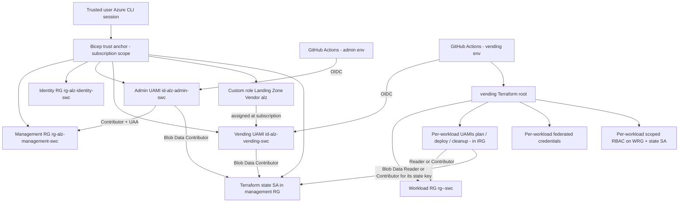

# Implementation Plan

## Purpose

This document is the authoritative resume point for the platform (landing zone) repository. Update the progress checklist and decision log whenever a phase completes or the design changes.

This repository prepares the **authority and shared foundation** that lets workload repositories deploy to Azure through GitHub Actions using OIDC, least-privilege identities, and no client secrets. It does **not** deploy workloads. The first AKS workload deploys itself from a separate repository (`terraform-aks-sandbox`) using the identities and state backend this platform vends.

## Scope

In scope (this repository):

- Trust anchor (Bicep): the two persistent RGs (management + identity), the two platform UAMIs (admin + vending) and their OIDC federated credentials, the `Landing Zone Vendor (alz)` custom role, and the shared Terraform state SA — all provisioned in one subscription-scope Bicep deployment run once locally.
- Vending Terraform (`vending/`) that mints per-workload identities, federated credentials, and RBAC through the guardrailed `modules/workload-identity` module.
- The GitHub Actions workflows that run vending under the bounded `vending` environment, and the OIDC / state-backend smoke test that runs under `admin`.
- Publishing the platform contract and seeding each workload repository's environments.
- Later: shared connectivity, identity/security, and policy guardrails.

Out of scope (owned by workload repositories):

- AKS Terraform and any workload infrastructure.
- Workload deploy, destroy, and scheduled TTL-cleanup workflows.
- Workload runtime specifics such as node SKU, networking plugin, and TTL policy.

## Current checkpoint

Last reviewed: 2026-08-17

- [x] Public GitHub repository created; account and repository security settings hardened.
- [x] Local Git author uses the GitHub `noreply` address. Single-trunk model: `main` is the default and only long-lived branch; work happens on short-lived branches merged via pull request (the retired `dev` integration branch is gone).
- [x] Terraform 1.15.8 installed locally; provider `hashicorp/azurerm ~> 4.0` pinned.
- [x] Personal Azure context selected: `Visual Studio Enterprise Subscription`, region `swedencentral`.
- [x] Repository split completed: this repo (`azure-landing-zone`, private) owns platform authority; workloads deploy from their own repos (first workload: `terraform-aks-sandbox`).
- [x] Trust anchor migrated to the CAF `alz` platform prefix and re-pointed to this repo.
- [x] Trust anchor deployed (Bicep, subscription scope). It now owns two persistent RGs (Resource Groups) and both platform identities:
  - `rg-alz-management-swc` — platform automation home.
  - `rg-alz-identity-swc` — persistent home for the workload identities vending mints.
  - `id-alz-admin-swc` — break-glass admin UAMI (User-Assigned Managed Identity), federated to GitHub environment `admin`; roles: Contributor + UAA (User Access Administrator) on management RG.
  - `id-alz-vending-swc` — bounded vending UAMI, federated to GitHub environment `vending`; holds the custom role `Landing Zone Vendor (alz)` at subscription scope (no Contributor, no Owner).
- [x] Terraform state backend moved into Bicep: one keyless (Entra-only) SA (Storage Account) with private `tfstate` container; Storage Blob Data Contributor granted to admin + vending.
- [x] `admin` and `vending` GitHub environments seeded by `bootstrap-trust/deploy.ps1`:
  - `admin` — branches: `main` only (break-glass).
  - `vending` — branches: `main` (apply/destroy run on merge; PR previews run with no environment).
  - Each environment: `AZURE_CLIENT_ID` + `AZURE_TENANT_ID` as variables, `AZURE_SUBSCRIPTION_ID` as a secret; repo variable `STATE_STORAGE_ACCOUNT_NAME` set.
- [x] OIDC + state-backend smoke test workflow (`.github/workflows/oidc-smoke-test.yml`) verified end-to-end as the `admin` identity.
- [x] Guardrailed Terraform module `modules/workload-identity/` and single-workload `vending/` root implemented, targeting the identity RG; workload RG is now owned by vending itself (created and destroyed with the workload).
- [x] Per-workload registry `vending/workloads/<name>.tfvars` established (committed via `.gitignore` exception; example: `taks.tfvars.example`).
- [x] Vending workflows: `.github/workflows/vending-pr-plan.yml` (read-only PR preview — plan for added/changed, `plan -destroy` for deleted), `vending-apply.yml` (re-plan + apply on merge), and `vending-destroy.yml` (re-plan + destroy on merge). Apply/destroy run under the `vending` environment, fan out per registry file, are **re-runnable** (a fresh re-plan each run, not a saved plan) and manually triggerable via `workflow_dispatch`, and seed the workload repo's login values via a repo-scoped GitHub App token.
- [x] Default-branch protection on `main`: require a pull request before merging (0 approvals, solo-friendly); the PR review + read-only plan preview is the gate (merge = deploy).
- [x] Workload repo seeding: on vend, `vending-apply` seeds the workload repository automatically with **repo-level** variables `AZURE_CLIENT_ID_<ENV>` (+ tenant, subscription, state account), via a least-privilege GitHub App (repo-scoped installation token). See Phase 6.

## Fixed decisions

| Area | Decision |
|---|---|
| Repositories | Private `azure-landing-zone` (platform), public `terraform-aks-sandbox` (workload) |
| Infrastructure tool | Terraform |
| Initial trust anchor | Subscription-scope Bicep deployment invoked through the authenticated Azure CLI |
| CI/CD system | GitHub Actions on GitHub-hosted runners |
| Azure authentication | GitHub OIDC workload identity federation; no client secrets or certificates |
| Region | Sweden Central (`swedencentral`) |
| Platform naming | CAF landing-zone model; platform prefix `alz`, workload prefix `taks`, region code `swc` |
| Platform archetypes | Management (now); Connectivity and Identity/Security (later) |
| Operating model | CI/CD-first; only the trust anchor runs locally, by the trusted user |
| Terraform state | Private Azure Blob Storage with Entra ID authorization; SA provisioned by the Bicep trust anchor |
| State lifecycle | Lives with the current Azure subscription; a future subscription receives a new backend and fresh deployment |
| Platform identity model | Two platform UAMIs: `admin` (break-glass, Contributor + UAA on the management RG) and `vending` (bounded, custom role `Landing Zone Vendor (alz)` at subscription scope) |
| Per-workload identity model | Vending mints one UAMI per role (typically plan / deploy / cleanup) per workload; each gets Reader or Contributor on its own workload RG and the matching Storage Blob Data role on the state SA |
| Apply/destroy model | One deploy identity per workload; separate protected GitHub environments and approvals per operation |
| Pull requests | Offline checks only; no Azure OIDC token |
| Runners | GitHub-hosted only |

## Two-repository architecture

The project is split into two repositories with different lifecycles, permissions, and change cadence. Sections below that describe the trust anchor, foundation Terraform, remote-state sequence, and OIDC requirements now execute inside the platform repository.

| | Platform (landing zone) | Workload |
|---|---|---|
| Repository | `azure-landing-zone` (private) | `terraform-aks-sandbox` (public) |
| Owns | Trust anchor, state backend, routine CI identities, RBAC, later App Configuration and Key Vault | AKS cluster and its short-lived resources |
| Lifecycle | Persistent; changes rarely | Disposable; recreated often |
| Credentials | Elevated; established once by a trusted user | Narrow federated identities; CI/CD only |
| First run | One manual trust-anchor deployment (irreducible) | None; fully CI/CD from the first commit |

The platform runs once to establish authority, then provisions everything the workload needs. The workload never bootstraps itself.

### Interface the workload consumes from the platform

- State backend: storage account and container names.
- Workload federated identities (client IDs stored as workload GitHub environment values).
- Resource group names and region.
- Later: App Configuration endpoint and Key Vault URI for runtime values.

### Division of responsibility

- The platform repository (this repo) owns the trust anchor, state backend, CI identities, RBAC, and later the shared services and policy guardrails.
- The workload repository owns its own Terraform root, its deploy/destroy/cleanup workflows, and its runtime configuration. Those are not tracked in this plan.
- Branch protection applies to each repository independently.

## Architecture



## Why one initial action is unavoidable

A new public GitHub repository has no Azure identity. Azure cannot securely allow an unauthenticated workflow to create its own identity or permissions. A trusted Azure user must establish the first trust relationship once.

The initial action will not create a client secret and will not create Terraform state locally. It will submit a declarative Bicep deployment through the already authenticated Azure CLI. Azure Resource Manager records that deployment.

After the trust anchor exists, GitHub Actions creates and manages the remaining infrastructure.

## Resource ownership boundaries

### Trust-anchor Bicep deployment (`bootstrap-trust/`)

The subscription-scope Bicep deployment owns everything that must exist before Terraform can run in CI:

- Management RG `rg-alz-management-swc` and identity RG `rg-alz-identity-swc`.
- Admin UAMI `id-alz-admin-swc` and its GitHub OIDC federated credential (`github-admin`).
- Vending UAMI `id-alz-vending-swc` and its GitHub OIDC federated credential (`github-vending`).
- Custom role `Landing Zone Vendor (alz)` at subscription scope, assigned to the vending identity.
- Terraform state SA (`Standard_LRS`, shared keys disabled, TLS 1.2, no public blob, blob versioning + 7-day soft-delete, private `tfstate` container), with Storage Blob Data Contributor granted to admin and vending.
- Contributor + UAA (User Access Administrator) for admin, scoped only to the management RG.

Neither platform identity receives subscription-wide Contributor or Owner. The vending identity's authority is limited to the actions its custom role explicitly lists (RGs, UAMIs, federated credentials, role assignments, and read-only SA metadata).

### Vending Terraform root (`vending/`)

The vending Terraform root, running as the `vending` UAMI in GitHub Actions, owns per-workload:

- One workload RG (`rg-<workload>-swc`) created and destroyed with the workload.
- One UAMI per role (typically plan / deploy / cleanup), living in the shared identity RG so identities outlive their disposable workload RG.
- One federated credential per `(identity, environment)` pair, with an exact OIDC subject and no wildcards.
- One Reader or Contributor assignment per identity scoped to the workload RG.
- One Storage Blob Data Reader or Contributor assignment per identity scoped to the state SA.

The guardrailed module `modules/workload-identity` enforces role and scope caps at plan time. The vending root also uses one Terraform state file per workload (`<name>.tfstate`) so a workload's blast radius stays inside its own state.

The workload's own Terraform root (in the workload repository) owns its AKS cluster and short-lived resources. Destroying it must never delete the trust-anchor resources, the state SA, or the vended identities owned here.

## Identity and access model

Platform identities (owned by the Bicep trust anchor, live in this repo):

| Identity | GitHub environment | Azure access | State access | Invocation |
|---|---|---|---|---|
| `id-alz-admin-swc` | `admin` (branches: `main`) | Contributor + UAA on `rg-alz-management-swc` | Storage Blob Data Contributor on state SA | Break-glass; manual, protected |
| `id-alz-vending-swc` | `vending` (branches: `main`) | Custom role `Landing Zone Vendor (alz)` at subscription scope | Storage Blob Data Contributor on state SA | Vending pipeline (PR plan / merge apply) |

Per-workload identities (minted by the vending pipeline, live in `rg-alz-identity-swc`, consumed from the workload's own repo):

| Identity (per workload) | Workload GitHub environment | Azure access | State access | Invocation |
|---|---|---|---|---|
| `id-<workload>-plan-swc` | e.g. `aks-plan` | Reader on the workload's own RG | Storage Blob Data Reader on the state SA | Trusted default-branch plan; never untrusted PR code |
| `id-<workload>-deploy-swc` | e.g. `aks-apply`, `aks-destroy` | Contributor on the workload's own RG | Storage Blob Data Contributor on the state SA | Manual, protected |
| `id-<workload>-cleanup-swc` | e.g. `ttl-cleanup` | Contributor on the workload's own RG | Storage Blob Data Contributor on the state SA | Scheduled and manually testable |

Notes:

- Apply and destroy share the deploy identity because Terraform requires the complete resource lifecycle; separate GitHub environments preserve separate approvals and audit trails.
- The cleanup identity is separate because scheduled cleanup cannot wait for approval.
- `Contributor` does not permit role assignment changes. Routine workload code must not create Azure role assignments.
- The module's guardrails cap the vendable control-plane role to Reader/Contributor and the state role to Blob Data Reader/Contributor; Owner and role-granting roles are refused at plan time.

## OIDC trust requirements

Every federated credential must use:

- Issuer: `https://token.actions.githubusercontent.com`
- Audience: `api://AzureADTokenExchange`
- Exact, case-sensitive subject for one repository and one GitHub environment.
- GitHub immutable owner and repository IDs because the repository was created after 2026-07-15.

Platform environments (this repository):

```text
admin     # break-glass, branches: main
vending   # bounded vending pipeline, branches: main (apply/destroy on merge)
```

Workload environments (workload repository, e.g. `terraform-aks-sandbox`):

```text
aks-plan
aks-apply
aks-destroy
ttl-cleanup
```

Never guess an OIDC subject. Retrieve the repository's actual immutable subject format and identifiers through GitHub before creating Azure federated credentials. `bootstrap-trust/deploy.ps1` derives the two platform subjects from `gh api repos/<repo>/actions/oidc/customization/sub` and passes them as Bicep parameters — no subject is committed.

Only jobs that authenticate to Azure receive:

```yaml
permissions:
  contents: read
  id-token: write
```

Pull request validation jobs receive `contents: read` only.

## GitHub configuration model

The following values are identifiers, not authentication secrets. Each platform environment (`admin`, `vending`) carries its own set so they stay behind the environment gate and its branch policy. They are split by disclosure sensitivity: the two effectively public identifiers are stored as environment variables, and the subscription ID is stored as an environment secret to keep it out of the settings UI.

```text
AZURE_CLIENT_ID        # per-environment variable (different for admin and vending)
AZURE_TENANT_ID        # per-environment variable
AZURE_SUBSCRIPTION_ID  # per-environment secret
```

One repo-level variable is also set for CI convenience (not a secret):

```text
STATE_STORAGE_ACCOUNT_NAME  # repo variable used in -backend-config
```

No environment may contain:

```text
AZURE_CLIENT_SECRET
AZURE_CREDENTIALS
Storage account keys
Terraform state or plan files
Kubeconfig
```

GitHub configuration should be automated with GitHub CLI or API after one interactive GitHub authorization. Never create a broad personal access token solely for this project.

## Remote-state bootstrap sequence

There is no state chicken-and-egg to solve in Terraform: the state SA is provisioned by the Bicep trust anchor before any Terraform runs, so every Terraform root uses the AzureRM backend from its first invocation.

Each root supplies its backend configuration at `init` time via `-backend-config` — never a committed backend file with account-specific values. The `vending/` root uses a per-workload state key so blast radius stays inside one workload:

```powershell
terraform -chdir=vending init -input=false `
  -backend-config="resource_group_name=rg-alz-management-swc" `
  -backend-config="storage_account_name=$env:STATE_STORAGE_ACCOUNT_NAME" `
  -backend-config="container_name=tfstate" `
  -backend-config="key=<workload>.tfstate"
```

Failure handling:

- If a Terraform run fails, inspect Azure resources before retrying; never attach to or overwrite an unknown state file.
- If the trust anchor itself needs to change, re-run `bootstrap-trust/deploy.ps1`. It is idempotent and safe to re-run.

## Storage security requirements

The state Storage account must have:

- Standard locally redundant storage unless a stronger redundancy requirement is introduced.
- HTTPS-only traffic.
- Minimum TLS 1.2.
- Public blob access disabled.
- Shared-key authorization disabled after confirming all backend operations use Entra ID.
- Blob versioning enabled.
- Blob and container soft delete enabled.
- Private `tfstate` container.
- Microsoft Entra ID data-plane authorization.
- Narrow role assignments at the smallest practical state scope.
- Public network reachability only because GitHub-hosted runner outbound IPs are not stable; this does not mean anonymous data access.

State files and saved plans are sensitive. They must never enter Git, public workflow logs, caches, or artifacts.

## Planned repository layout

Two repositories.

Platform — `azure-landing-zone` (private):

```text
.github/
  copilot-instructions.md
  workflows/
    oidc-smoke-test.yml      # OIDC + backend smoke test (runs as admin)
    vending.yml              # applies vending/ per workload (runs as vending)
bootstrap-trust/             # Bicep trust anchor (run once, locally)
  main.bicep                 # subscription scope: RGs + platform UAMIs + custom role + state SA
  deploy.ps1                 # idempotent: deploys Bicep + seeds admin+vending GitHub envs
  modules/
    identity.bicep           # generic UAMI + GitHub OIDC federated credential
    role-assignments.bicep   # generic list-based RG-scope role assignments
    state-storage.bicep      # keyless Entra-only state SA + Blob Data Contributor grants
  README.md
modules/
  workload-identity/         # Terraform module: vends one workload's identities (guardrailed)
    main.tf
    outputs.tf
    variables.tf
    versions.tf
vending/                     # Terraform: single-workload root; one state file per workload
  backend.tf                 # partial azurerm backend; details via -backend-config
  main.tf
  outputs.tf
  providers.tf
  variables.tf
  versions.tf
  workloads/
    <name>.tfvars            # committed per-workload registry (.gitignore exception)
    taks.tfvars.example
config/
  project.json
docs/
  implementation-plan.md
  onboarding.md
  security-model.md
CHANGELOG.md
README.md
SECURITY.md
```

Note: there is no separate `management/` Terraform root. The state SA that a `management/` root would have provisioned is provisioned by the Bicep trust anchor, so Terraform never needs to own its own backend.

The workload repository (`terraform-aks-sandbox`) owns its own `infrastructure/` Terraform root and CD workflows; its layout is tracked in that repository, not here.

The one module, `modules/workload-identity/`, exists because vending is reused for every workload; no other modules are introduced until repeated infrastructure creates real complexity.

## Implementation phases

### Phase 0: Commit the safe foundation

- [x] Review all current untracked files.
- [x] Update `CHANGELOG.md` before the first commit; create it if needed.
- [x] Run secret and PII pattern checks.
- [x] Run `git diff --check` and focused Terraform validation.
- [x] Stage changes and present the staged diff for explicit approval.
- [x] Commit only after explicit user approval.
- [x] Push `dev` only after explicit user approval.

Exit criteria:

- The public repository contains documentation and the no-cloud learning exercise, with no identifiers, credentials, state, or plans.

### Phase 1: Prepare GitHub trust metadata

- [x] Install GitHub CLI through an approved installation path.
- [x] Authenticate GitHub CLI interactively without sharing tokens through chat.
- [x] Verify the authenticated GitHub account and target repository.
- [x] Retrieve repository owner ID and repository ID.
- [x] Determine the exact immutable OIDC subject for each environment.
- [x] Create the `bootstrap` GitHub environment.
- [x] Restrict it to the `dev` deployment branch during initial implementation.
- [x] Disable administrator bypass; independent reviewer approval is not available for the current single-maintainer model.

Exit criteria:

- Exact OIDC metadata is known and no Azure trust has yet been granted to a guessed subject.

### Phase 2: Implement and validate the trust anchor

- [x] Write the minimal subscription-scope Bicep template under `bootstrap-trust/`.
- [x] Parameterize region, generic project prefix, GitHub immutable subject, and tags.
- [x] Avoid tenant, subscription, user, and resource IDs in committed parameter files.
- [x] Validate Bicep syntax.
- [x] Run Azure deployment validation and what-if.
- [x] Review every proposed resource and role scope.
- [x] Deploy only after explicit user approval.
- [x] Capture only the bootstrap identity client ID as protected output; do not print tenant or subscription IDs unnecessarily.

Azure What-If confirmed two resource groups, one managed identity, and one federated credential as creates. It marks the four role assignments as unsupported because the new identity's principal ID is generated only during deployment; Azure deployment validation succeeded and Bicep compilation confirms their schema and scope.

Exit criteria:

- Both project resource groups, bootstrap identity, exact federated credential, and resource-group-scoped bootstrap roles exist.
- No client secret exists.

### Phase 3: Configure the protected bootstrap environment

- [x] Add the three OIDC identifiers to the `bootstrap` GitHub environment through authenticated automation: `AZURE_CLIENT_ID` and `AZURE_TENANT_ID` as environment variables, `AZURE_SUBSCRIPTION_ID` as an environment secret.
- [x] Confirm values are environment-scoped, not repository-scoped, and absent from source code, logs, or artifacts.
- [x] Restrict environment deployment branches (restricted to `dev` in Phase 1).
- [x] Confirm Actions default token remains read-only (`default_workflow_permissions: read`).

Exit criteria:

- A workflow job using only the `bootstrap` environment can request an OIDC token, while ordinary jobs cannot.

### Phase 3.5: Split into platform and workload repositories

- [x] Create the private `azure-landing-zone` repository.
- [x] Move `bootstrap-trust/` (and, at the time, `bootstrap/`) plus platform-only docs into it; initialize `.gitignore`, `.gitattributes`, and branch `dev`.
- [x] Add `config/project.json` as the shared configuration source.
- [x] Retrieve the platform repo's immutable OIDC subject and re-point the trust anchor's federated credential to it.
- [x] Remove the trust anchor and platform environments from the workload repo.
- [x] Reduce the workload repo to AKS scope.

Exit criteria (met):

- Platform authority lives only in `azure-landing-zone`.
- The workload repo contains no trust anchor.
- The federated credential's subjects reference this repository's environments exactly.

### Phase R: Re-point the trust anchor and adopt `alz` naming

- [x] Update the Bicep trust anchor to the immutable OIDC subjects for this repository's platform environments.
- [x] Rename platform resources to the `alz` platform prefix; reserve `taks` for the AKS workload.
- [x] Compile Bicep offline, run `az deployment sub what-if`, redeploy after review.
- [x] Reseed OIDC identifiers on the platform environments (via `bootstrap-trust/deploy.ps1`).
- [x] Delete the superseded `taks`-named bootstrap resource group and identity.

Exit criteria (met):

- Platform resources use the `alz` prefix and every federated credential targets an exact subject in this repository.

### Phase 4: Retire the standalone bootstrap Terraform root

Superseded. The state SA moved into the Bicep trust anchor (`bootstrap-trust/modules/state-storage.bicep`), eliminating the state chicken-and-egg. Terraform no longer owns its own backend, so there is no `bootstrap/` or `management/` root. What remains of this phase became:

- [x] Implement the guardrailed `modules/workload-identity` Terraform module (pinned Terraform + provider versions, variable validation, safe outputs).
- [x] Implement the single-workload `vending/` root that consumes the module.
- [x] Establish the per-workload registry `vending/workloads/<name>.tfvars` (committed via a `.gitignore` exception).
- [ ] Commit `.terraform.lock.hcl` for the `vending/` root after a first `terraform init` under CI.

Exit criteria:

- `vending/` validates and contains no account-specific values in source.

### Phase 5: Implement and run the vending workflow

- [x] Add a v1 manual `plan` workflow `.github/workflows/vending.yml` running under the `vending` environment.
- [x] Grant only `contents: read` and `id-token: write` on that workflow.
- [x] Verify OIDC + state backend via `oidc-smoke-test.yml` (runs under `admin`).
- [ ] Pin every GitHub Action to a full commit SHA with a same-line release comment.
- [x] Prevent state and plan artifact upload (explicit `--input=false`, no artifact steps — the convergent design re-plans on merge and carries no plan artifact).
- [ ] Add workflow concurrency per workload.
- [x] Expand to PR-plan / merge-apply + a changed-workload matrix (v2).

Exit criteria:

- Vending pipeline plans and applies each workload's identities under the bounded `vending` identity, with no plaintext cloud credential in GitHub.

### Phase 6: Seed the workload repository (contract handover)

- [x] Publish the platform contract as Terraform outputs: `workload_identity_client_ids`, `environment_client_ids` (environment → client ID), and `workload_repo_slug`.
- [x] Seed the workload repository automatically on vend, via a least-privilege GitHub App (repo-scoped installation token): **repo-level** variables `AZURE_CLIENT_ID_<ENV>` (`plan` / `apply` / `destroy` / `cleanup`), `AZURE_TENANT_ID`, and `STATE_STORAGE_ACCOUNT_NAME`, plus the `AZURE_SUBSCRIPTION_ID` secret. The platform does **not** create the workload's environments (that would need the App `Administration` permission); GitHub auto-creates each environment when the workload's own job references `environment: <env>`. The non-secret client-id-per-environment mapping preserves identity separation; the OIDC subject `:environment:<env>` remains the gate.
- [x] `vending-destroy` un-seeds those values on offboard (derived from the intake file + a live variable listing, so it is state-independent and re-runnable).
- [x] Document the interface so the workload team consumes it without tribal knowledge (`docs/onboarding.md`).

Exit criteria:

- The workload repository can authenticate to Azure and read state using only vended identities and published values.

### Phase 7: Protect the default branch

- [ ] Create the default branch after the platform workflow exists.
- [ ] Require pull requests and successful checks after each check has completed once.
- [ ] Block force pushes and deletion; require conversation resolution.
- [ ] Require linear history and use squash merge.
- [ ] Evaluate signed-commit enforcement only after signing is configured.

Exit criteria:

- Privileged platform source cannot change on the default branch without the configured review and checks.

### Phase 8: Platform roadmap (later)

- [ ] Connectivity: `rg-alz-connectivity-swc` hub VNet and peering for workload spokes.
- [ ] Identity/Security: `rg-alz-security-swc` shared Key Vault, Log Analytics, and managed identities.
- [ ] Governance: Azure Policy guardrails inherited by workload resources.
- [ ] Self-service vending: an intake form or portal collects a workload's inputs (prefix, OIDC subject, size) and triggers a pipeline that provisions its landing zone and returns the contract, replacing the manual `terraform.tfvars`.

### Phase 9: Platform teardown and subscription exit

- [ ] Confirm no workload still depends on the platform's identities or state.
- [ ] Optionally export and encrypt state for records; never commit plaintext state.
- [ ] Remove routine federated credentials and role assignments.
- [ ] Remove trust-anchor resources after no workflow depends on them.
- [ ] In a replacement subscription, create a fresh trust anchor and state backend from the same source.

Exit criteria:

- No abandoned billable platform resources or live GitHub-to-Azure trust remains in the expiring subscription.

## Validation gates used throughout

Run the narrowest relevant checks after every edit:

```text
terraform fmt -check -recursive
terraform validate
tflint
security scanner
secret scanner
git diff --check
```

Before every Azure modification:

1. Verify the active account is non-corporate.
2. Verify the subscription display name is `Visual Studio Enterprise Subscription`.
3. Hide tenant and subscription IDs from output.
4. Run validation or what-if/plan.
5. Present the proposed change for explicit approval.

After every Azure modification:

1. Verify only expected resource types and scopes changed.
2. Check for unexpected role assignments.
3. Confirm no secret or sensitive identifier was printed or persisted in Git.
4. Record the completed checkpoint in this document.

## Interruption and resume protocol

When work resumes after interruption:

1. Read this file and `docs/security-model.md`.
2. Run `git status --short --branch`.
3. Check the first incomplete phase and its exit criteria.
4. Verify the active Azure account classification and subscription name without displaying IDs.
5. Inspect existing Azure resources before rerunning any failed create operation.
6. Never assume a failed workflow made no changes.
7. Never delete, import, or overwrite Terraform state until the current backend and resource ownership are understood.
8. Update the current checkpoint and decision log before ending the session.

## Decision log

| Date | Decision | Reason |
|---|---|---|
| 2026-08-13 | Use Sweden Central | Lowest practical European price among compared regions at the time of review |
| 2026-08-13 | Use four CI identities | Teach workload identity federation and separate scheduled cleanup from human-approved deployment |
| 2026-08-13 | Apply and destroy share deployment identity | Terraform requires create/update/delete lifecycle permissions; environments provide operation separation |
| 2026-08-13 | Use minimal Bicep trust anchor | Eliminates local Terraform bootstrap state while preserving an auditable declarative first deployment |
| 2026-08-13 | Bicep owns bootstrap identity and both resource groups | Breaks the initial authentication and resource-group creation cycle without subscription-wide routine Contributor access |
| 2026-08-13 | Terraform owns state Storage and three routine identities | Keeps normal project infrastructure in Terraform after trust is established |
| 2026-08-13 | State lives in the current Azure subscription | Standard AzureRM backend pattern; deployment is intentionally replaceable when the subscription ends |
| 2026-08-13 | Use Bicep resource-group modules under the subscription root | Bicep requires resource-group-scoped resources and role assignments to be deployed through modules at those scopes |
| 2026-08-14 | Scope all three OIDC identifiers to the `bootstrap` environment; store `AZURE_CLIENT_ID` and `AZURE_TENANT_ID` as variables and `AZURE_SUBSCRIPTION_ID` as a secret | Environment scope keeps the identifiers behind the environment gate and `dev` branch restriction on a public repo; the client ID varies per environment while the subscription secret stays out of the settings UI |
| 2026-08-14 | Split into two repositories: private `azure-landing-zone` (platform) and public `terraform-aks-sandbox` (workload) | Separates persistent, elevated, run-once platform from disposable, narrow, CI/CD workload; matches platform-engineering practice and isolates blast radius |
| 2026-08-14 | Reframe as a CAF landing zone; scope this repository to platform authority only | The platform vends identities, state, and guardrails; workloads deploy themselves from their own repositories |
| 2026-08-14 | Adopt the `alz` platform prefix and CAF archetypes (management, connectivity, identity); reserve `taks` for the AKS workload | Shared platform resources must be workload-agnostic; a workload name should not brand the foundation |
| 2026-08-14 | Confirm the CI/CD-first operating model | Everything runs in GitHub Actions; only the irreducible trust anchor runs locally, by the trusted user |
| 2026-08-15 | Move the Terraform state SA into the Bicep trust anchor | Removes the state chicken-and-egg (Bicep needs no backend) and stops Terraform from owning its own state store |
| 2026-08-15 | Replace the single-purpose `bootstrap-identity.bicep` with a generic `identity.bicep` module | The same shape (UAMI + one GitHub OIDC federated credential) is used for every platform identity; parameterising the credential name lets `main.bicep` reuse it |
| 2026-08-15 | Switch `vending/` from a workloads map to one workload per apply, with one state key per workload | Isolates blast radius per workload; a broken workload declaration cannot corrupt another workload's state |
| 2026-08-15 | Make workload region per-workload (`location` / `location_code` in each tfvars) | Shared config is used only for the platform management RG; each workload picks its own region |
| 2026-08-16 | Replace the single `bootstrap` GitHub environment with two: `admin` (break-glass, `dev` only) and `vending` (dev plan / main apply) | Vending must not run under a break-glass identity; a bounded automation identity is the whole point of the vending pattern |
| 2026-08-16 | Introduce a dedicated identity RG `rg-alz-identity-swc` | Vended workload identities are CAF identity-archetype resources; keeping them out of the management RG makes lifecycle and blast radius clear |
| 2026-08-16 | Introduce a custom role `Landing Zone Vendor (alz)` for the vending identity instead of built-in Contributor | Vending needs to create RGs, UAMIs, federated credentials, and role assignments \u2014 and nothing else; Contributor is broader than that |
| 2026-08-17 | Move the workload RG from a data source to a `resource` in `vending/` | Makes onboarding self-service (no manual RG create) and gives vending the ability to destroy it when a workload is retired |
| 2026-08-17 | Route the vending pipeline through `environment: vending` (not `admin`) | The bounded custom role and its `main`-branch policy exist so vending doesn't run as break-glass |

## Explicit non-goals

- Production-grade multi-region AKS.
- Hosting valuable or irreplaceable workload data.
- Self-hosted GitHub runners.
- Long-lived Azure client secrets.
- Subscription-wide routine deployment permissions.
- Automatic deployment from untrusted pull requests.
- Preserving the current AKS cluster after the Azure subscription is lost.
- Deploying AKS or any workload from this repository; workloads deploy themselves from their own repositories.